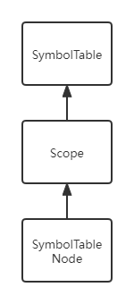

# 
Lab 3：局部变量	实验报告

19231061 宋永欣

## Part5 局部变量与赋值

引入块了之后需要维护符号表（防止重复定义），符号表使用vector实现，链表形式，类图如下。

搜索Ident的路径为：首先在当前scope找，如果未找到，通过Scope类中的`parentScopeIndex`找到当前scope的上一层scope，在该层继续搜索，如此迭代直至**找到**或者到**全局也未找到**。

递归下降分析程序没有什么特别需要讲的，就把每个函数写好让他递归即可，涉及到选择分支就通过看follow集和look ahead来解决。但是翻译成llvm时，注意到变量实际上存的`%xx`是一个地址，定义时`alloca`分配空间，存值时`store`，取值时需要利用一个临时寄存器`%xx`将地址中的值`load`出来。

> 注：本来为了减少指令数，将临时寄存器的值也存在SymboTableNode类中，这样如果重复使用一个变量的值且改值未改变时，可以直接从中拿出临时寄存器，而不用重新load，但是在后续加上条件语句后会由于流控制导致一些问题，故舍弃。

## Part6 调用函数

由于调用的这些函数都是外部库函数，所以可以简单地将这些函数手动放在全局作用域上，让所有调用库函数的地方都能找到函数定义。llvm中间代码也要在所有中间代码之前将这些函数的declare输出。

符号表中存了这些函数对应的参数数量和类型，调用时检查实参和形参的数量和类型是否匹配，不匹配则报错。

还需要注意函数的返回值类型，如果是void，则直接生成一句`call void @xxx`，但是如果返回值是int，则需要用一个临时寄存器去取函数的返回值，行为不同。

