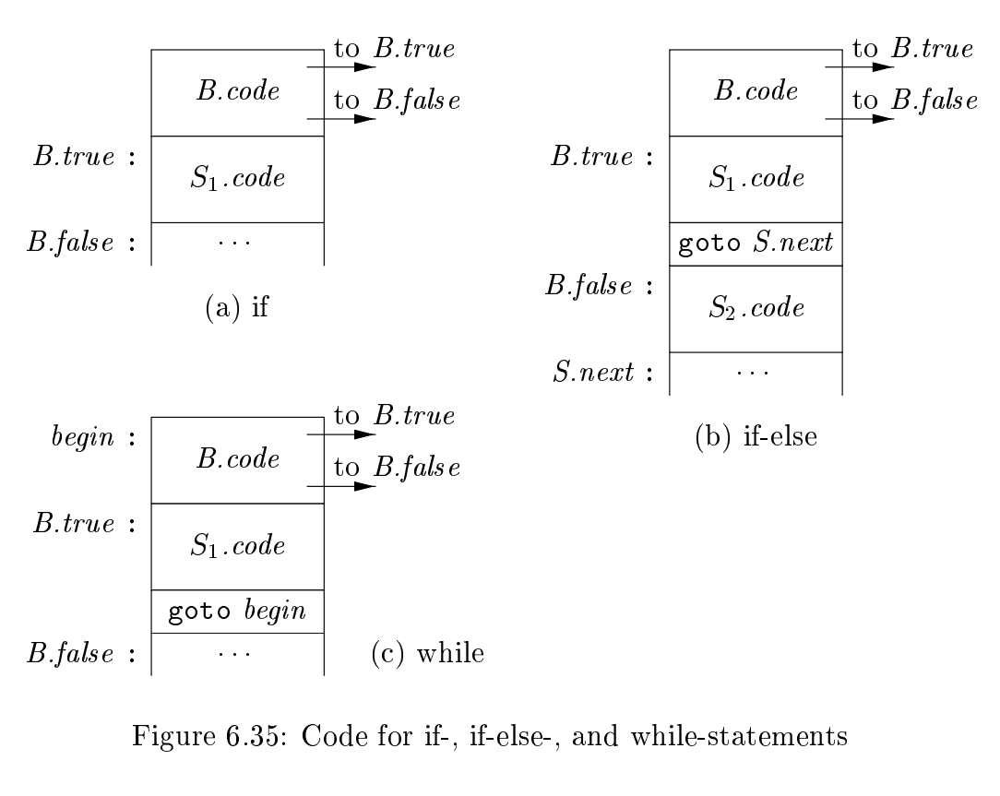
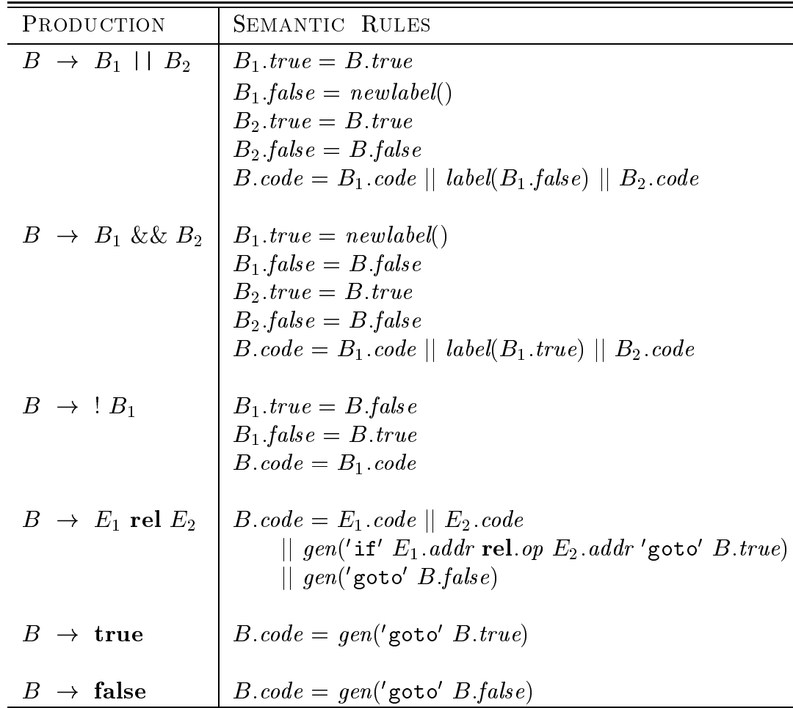

# <center>挑战实验：短路求值	实验报告</center>

<center>19231061 宋永欣</center>

## 挑战实验：短路求值

首先，由于`stmt`的分支比较多，会显得函数很乱，将每个分支都抽取出一个函数，if语句抽取出`ifStmt`函数。

流控制的基本架构：



进入`ifStmt`函数后，首先生成`trueLabel` `falseLabel`的编号，将这两个标签作为参数传递给`cond`，便于在`cond`中生成条件跳转`br i1 %xx, label trueLabel, label falseLabel`。处理完`cond`后，在中间代码中生成`trueLabel: `，表示一个新的基本块的开始。调用递归子程序`stmt`，如果这个stmt内有其他流控制的语句，则会返回一个标签（返回一词不太准确，因为是通过引用拿到的，但是这么说好理解），说明上一个基本块已经在`stmt`语句中结束了，要开始一个新的基本块，又在中间代码中生成一个新的label。

处理过后，无论后面有没有`else`，该基本块都应该结束，所以需要无条件跳转，此时生成一个`label`用于生成无条件跳转的中间代码`br lable`，并且最终这个label会作为返回值传回`stmt`子程序。

如果后面有`else`，则先在中间代码中生成`falseLabel: `，然后和`if`一样处理`stmt`，最后生成无条件跳转的中间代码`br lable`。

如果后面没有`else`，则先在中间代码中生成`falseLabel: `，然后直接生成无条件跳转的中间代码`br lable`。


这种处理方法虽然在没有`else`的情况下会多生成一个只有`br label`的基本块，但是胜在结构清晰，进基本块加`labelx:`，出基本块加`br labelx`，保证在多重流控制的时候不会出错。


已处理短路求值，就一起说了。



再详细说一下`cond`子程序，调用`lOrExp`，把`trueLabel` `falseLabel`作为参数传下来。

### `lOrExp`

`lOrExp -> lAndExp {('||') lAndExp}*`

```cpp
e.g. if /*br label1*/ ( /*label1: */ lAndExp(trueLabel, lAndFalseLabel) /*这块有东西，但是是在lAndExp里生成的，bu*/||/*trueLabel:*/ lAndExp /*lAndFalseLabel: */ /*br falseLabel*/) 
    /*trueLabel:*/	stmt	/*br falseLabel*/
    /*falseLabel:*/
```

> 大概就是这么个意思，凑合看下;
>
> 看着只有一个`br`的基本块可能有点别扭，但是不管咋说点是都过了

`lOrExp`先生成一个新的`lAndFalseLabel`，将  `trueLabel` `lAndFalseLabel`作为参数传递给 `lAndExp`。

由于短路求值的特点，或表达式，一旦为真，则直接跳到`trueLabel`，但是这个在`lAndExp`中处理，不归`lOrExp`管；否则（或表达式为假）就应该跳到下一个表达式，查看真假（前提是有`||`出现）。

有`||`出现时，由于进入了新的基本块，所以先中间代码中生成`lAndFalseLabel: `（就是与表达式为假时应该跳到的标签初），生成新的`lAndFalseLabel`的标号，然后作为参数传给 `lAndExp`，如此知道没有`||`。

`while`循环结束后（没有`||`了），在中间代码中生成`lAndFalseLabel: `，然后直接生成无条件跳转的中间代码`br falseLable`。

### `lAndExp`

由于短路求值的特点，与表达式，一旦为假，则直接跳到`falseLabel`，这个在`eqExp`中处理，不归`lAndExp`管；否则（与表达式为真）就应该跳到下一个表达式，查看真假（前提是有`&&`出现）。

先调用`eqExp`拿到一个布尔类型的返回值`cond`，要根据它生成条件跳转。如果有`&&`出现，则生成一个新的`newTrueLabel`的标号，生成条件跳转`br i1 cond newTrueLabel falseLabel`。由于是与表达式，为真时应该继续判断，所以生成`newTrueLabel :`的标签，然后进入子程序`eqExp`继续处理。当没有`&&`后，`lAndExp`到了结尾，该基本块应该跳转出去，所以生成条件跳转`br i1 cond trueLabel falseLabel`，意思是当所有`eqExp`都为真时，与表达式才为真。


> 大概就是这么个意思：

`... [br cond trueLabel lAndFalseLabel] || [lAndFalseLabel]: eqExp(cond) [br cond newTrueLabel1 falseLabel] && [newTrueLabel1]: eqExp(cond) [br cond newTrueLabel2 falseLabel] eqExp(cond) [newTrueLabel1]: [br cond trueLabel falseLabel]  `


### `eqExp` 和 `relExp`

没有太大难点，对op左右两边的进行op对应的比较即可，生成代码直接用llvm的`icmp`。

需要注意的是可能会出现`a == b == c`这样的条件，那么由于第一次比较得到的值是`i1`类型，但是`c`是`i32`类型，会出现类型不匹配，我是通过传递一个布尔值来让程序知道该值是否是`i1`类型，如果是，则需要先用`zext`转化为`i32`再进行比较。

> 这里也用了常量替换，编译能确定的就给他计算好。

最终传到`lAndExp`的值如果是`i1`  就直接用，如果是`i32`还要`icmp eq 0 val`。

`!`的情况就`icmp neq 0 val`


### 参考文献

[1] Compilers - Principles, Techniques, and Tools-Pearson_Addison Wesley (2006)
